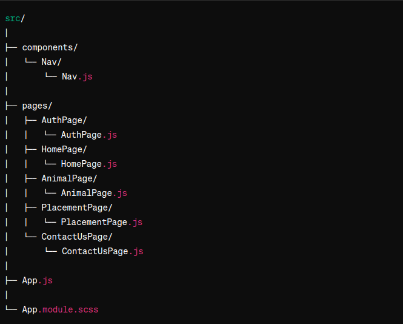

# Loving Paws Adoption Agency

[LiveLink](https://lovingpawsadoptionagency.jeremycasanova.me/)

This is a Adoption agency website that works with local shelters to help animals with placement.  

# Technologies used

Github
MongoDB
VsCode
Webpack
Babbel
Gulp
Mongoose
Express
React
Node
Html
Scss
Css
Javascript

# Big Poppa Code React Starter Kit

This Starter Kit is being used in this app.
Go here to here to learn some cool stuff.
[Big Poppa Code](https://bigpoppacode.io/) ---
[Kit Pkg](https://www.npmjs.com/package/big-poppa-code-react-starter)

# Reference Materials

[React Dev](https://react.dev/)
[MDN](https://developer.mozilla.org/en-US/)
[W3Schools](https://www.w3schools.com/sass/default.asp)
[Big Poppa Code Channel](https://www.youtube.com/@bigpoppacode)
[Geeks for Geeks](https://www.geeksforgeeks.org/)
[Npm Docs](https://docs.npmjs.com/)
[Npm+runKit](https://npm.runkit.com/?q=)

# Wireframe

# Pseudo files and folder structure

Front-End

Back-End

# Setup Instructions

# create .env with your mongoDB collection link/password and secret key.

# npm i (to install dependencies)

# npm run seed (to add all items from seed.js file to mongoDB)

# npm run dev(to load localhost URL)

# Icebox

 Add chat ai and help page, make animals appear dog page and cat page, update code to list only dog or cat on each page,
 create category list to use on only those pages, add filter add searchbar. add alot more styling get pictures and info from local shelters. add slideshow of latest adoptions to home page. add public path in webpack and forgot password on auth page. add action for adopt or surrender animal. in the form add name, phone number, email.
 have it send confirmation letter upon placement form completed. have contact us page have a ticket form and create support ticket form component, and have it send verification email that ticket was submitted.

